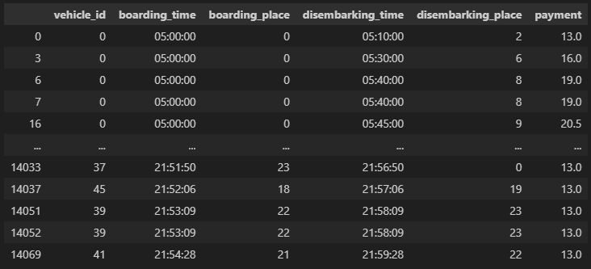
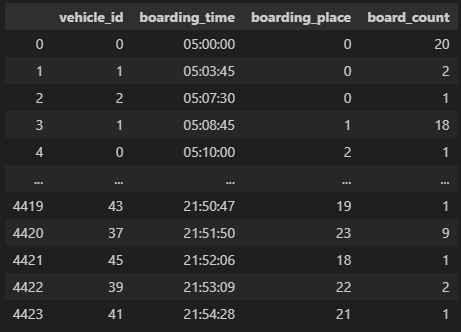
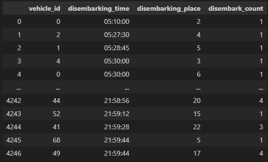
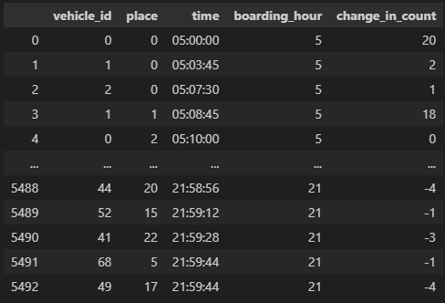
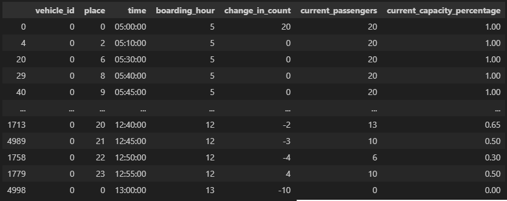
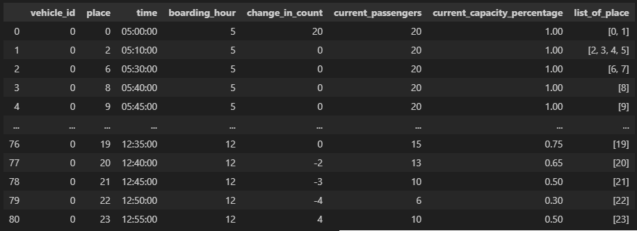
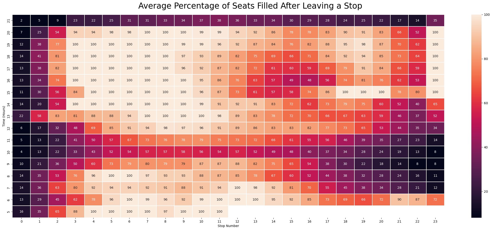
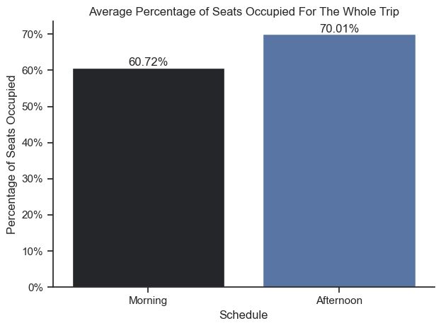
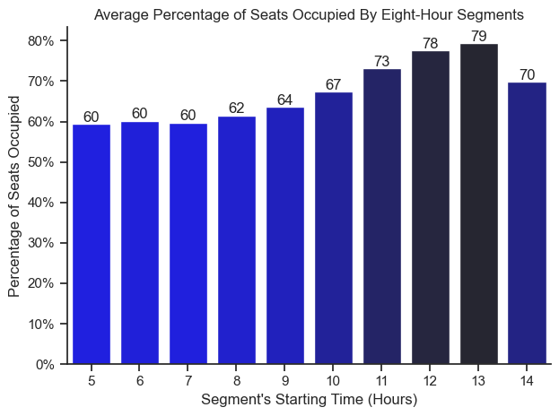

# Overview
This is a collection of projects I did to practice and demonstrate my skills. Most of the codes will not be shown here to keep this clean. Check out the individual projects for more details.
## 1_Efficient_Transportation
The schools I went to are very far from home, so I commuted regularly. While it was not common, I occasionally waited long times for jeepneys. So then I wondered, if public transportation is run by companies, how would they improve their operations to meet the demand.

Assumptions:
- The route's length is 42 kilometers
- There is a stop for every kilometer
- A vehicle has a max capacity of 20
- In general, the further you travel, the more you pay
### Creating a somewhat realistic sample information
Since I do not have a datasheet provided by a company, I just created an imaginary one. It contains the following information
- Boarding time: When did the passenger board (random number generator (RNG))
- Boarding place: Where did the passenger board. Let's say the stops are labeled using numbers (RNG not exceeding the route length)
- Boarding payment: How much did the passenger pay (function of the distance traveled)

Resulting sample datasheet:


### Cleaning the data
Minimal cleaning is needed because the sample data is simple. I just sorted the data by time and added a new column containing the hour part of the boarding time to make visualizations cleaner.

Cleaned datasheet:


### Visualizations
Distribution of where and when passengers board:


Distribution of profit by time and place:


Minimum number of vehicles needed to fill the demand by hour:


*This is calculated by dividing the number of recorded passengers per hour by the max capacity of a vehicle*
### Insights
- I realized that basing how many vehicles to operate on the previous number of passengers is a mistake. This is because we are ignoring unseen information.
- The problem is that we can only gather information when passengers board. Say we field one vehicle and it is always full at every stop, containing 20 passengers. Do we conclude we only need one vehicle since in our records, the demand peaks at 20?
- Rather, it is better to look at the average percentage of seats filled of the whole fleet. 
- The sample data I am working on does not have a vehicle ID column. How can I calculate the average for the whole fleet if I do not have information about the individual vehicles?
- Using another simple random number generator for the vehicle ID might result in vehicles sometimes exceeding capacity and/or vehicles going backwards (when RNG generates records of vehicle 1 at stop 3 at 5:05am and then at stop 2 at 5:12am).
## 2_Efficient_Transportation_v2
To avoid the mistakes and irregularities mentioned in 1_Efficient_Transportation, I decided that the easiest way to generate credible data without public utility vehicles magically exceeding capacity or going backwards is to just do a simple simulation of them running through the route and getting passengers. I am interested in simulations anyway so this is good beginner practice.

Assumptions:
- The route's length is 24 kilometers
- There is a stop for every kilometer
- The route is a cycle i.e. vehicles end up on the starting position (0) after traveling the route's length
- A vehicle has a max capacity of 20
- In general, the further you travel, the more you pay
- Drivers work eight-hour shifts, so there are morning and afternoon shifts for them
- Each vehicle has its own schedule to follow
- There are 32 morning shift vehicles and 38 afternoon shift vehicles
### Creating a somewhat realistic sample information
- Vehicles cannot record passengers boarding and leaving without the passengers themselves. First, I created a set of possible passenger objects located at random stops at random times. There are also NoonPassenger, AfternoonPassenger, and EveningPassenger kinds of passengers. Here is the code for a MorningPassenger object:
```python
class MorningPassenger:
    def __init__(self, mean_start_place):
        # Defining when the passenger starts waiting for public transport
        self.mean_start_hour = 7
        self.sigma_start_hour = 1.8
        self.start_hour = -1
        while self.start_hour < 0 or self.start_hour >= 24:
            self.start_hour = int(round(np.random.normal(self.mean_start_hour, self.sigma_start_hour, 1)[0], 0))
        self.start_minute = random.randint(0, 59)
        self.start_second = random.randint(0, 59)
        self.start_time = time(self.start_hour, self.start_minute, self.start_second)

        # Defining where the passenger waits for public transport
        self.mean_start_place = mean_start_place
        self.sigma_start_place = 2
        self.start_place = -1
        while self.start_place < 0 or self.start_place >= route_length:
            self.start_place = int(round(np.random.normal(self.mean_start_place, self.sigma_start_place, 1)[0], 0))

        # Defining where the passenger wants to go to
        self.mean_end_place = (route_length + self.start_place) / 2
        self.sigma_end_place = 4
        self.end_place = self.start_place - 1
        while self.end_place <= self.start_place or self.end_place > route_length:
            self.end_place = int(round(np.random.normal(self.mean_end_place, self.sigma_end_place, 1)[0], 0))

        # Defining the fare the passenger will pay
        if self.end_place - self.start_place <= 4:
            self.payment = minimum_fare
        else:
            self.payment = minimum_fare + (self.end_place - self.start_place - minimum_distance) * additional_charge_per_unit

        global possible_passengers
        possible_passengers.append([self.start_time, self.start_place, self.end_place, self.payment])
```
- I then created Vehicle objects that have a method to run through the route, getting and dropping passengers. I took into consideration the possible mistakes and irregularities of simple randomly generated data. Each vehicle keeps their own record of passengers. Here is the code for the method of a Vehicle object:
```python
def stop(self, time):
    global possible_passengers
    global company_raw_data
    if time in self.arrival_time_per_stop:
        # The part where passengers disembark
        disembarking_passengers_index = []
        for iterator in range(len(self.passengers)):
            if (self.passengers[iterator][2] % route_length) == (self.arrival_time_per_stop.index(time) % route_length):
                disembarking_passengers_index.append(iterator)
                # We record the passenger's final information as they leave
                company_raw_data['vehicle_id'].append(self.vehicle_id)
                company_raw_data['boarding_time'].append(self.passengers[iterator][0])
                company_raw_data['boarding_place'].append(self.passengers[iterator][1])
                company_raw_data['disembarking_time'].append(time)
                company_raw_data['disembarking_place'].append(self.passengers[iterator][2] % route_length)
                company_raw_data['payment'].append(self.passengers[iterator][3])
        for index in sorted(disembarking_passengers_index, reverse = True):
            del self.passengers[index]
        self.current_capacity -= len(disembarking_passengers_index)

        # The part where passengers board
        i = 0
        boarding_passengers_index = []
        while self.current_capacity < self.max_capacity and i != len(possible_passengers) and time != self.arrival_time_per_stop[-1]:
            if possible_passengers[i][0] <= time and possible_passengers[i][1] == self.arrival_time_per_stop.index(time) % route_length:
                boarding_passengers_index.append(i)
                # Passenger's initial record as they board (boarding_time, boarding_place, disembarking_place, payment)
                self.passengers.append((time, possible_passengers[i][1], possible_passengers[i][2], possible_passengers[i][3]))
                self.current_capacity += 1
            i += 1
        for index in sorted(boarding_passengers_index, reverse = True):
            del possible_passengers[index]
```
- Just like in real life, I ran the simulation with respect to time.
```python
for hour in range(5, 22):
    for minute in range(60):
        for second in range(60):
            for vehicle in list_of_vehicles:
                vehicle.stop(time(hour, minute, second))
```

Resulting datasheet:



### Cleaning the data
How many passengers boarded at every stop every vehicle has made:



How many passengers disembarked at every stop every vehicle has made:



The change in the count of current number of passengers at every stop every vehicle has made:



I separated the whole record by vehicle ID to calculate individual average percentage of seats occupied for the whole trip. Here is the example individual record for vehicle ID 0:



Remember the hidden data because we only record information if a passenger boards or disembarks? We have to consider the stops made where no passenger boards or disembarks. Imagine that our record tells us that a vehicle had 10 passengers after leaving stop 1, 20 passengers after leaving stop 2, and 10 passengers after leaving stop 4. We do not have a record for stop 3 since no one boarded or disembarked. If we calculate the average for the the stops, we get (10 + 20 + 10) / 3 = 13.33 passengers for the whole trip. But if no one boarded or disembarked at stop 3, then it just means we left there with the same number of passengers as we had when we left stop 2. Considering this in the calculation for the average, we get (10 + 20 + 20 + 10) / 4 = 15. We also have to ignore the last stop every vehicle had made since we know it had no passengers by the end. After accounting for these, here is the new example individual record for vehicle ID 0:



### Visualizations
Average percentage of seats occupied after leaving stops:



Average percentage of seats occupied by schedule:



Average percentage of seats occupied by eight-hour segments



### Insights
- Morning shift vehicles have an average capacity of 60.72%.
- Afternoon shift vehicles have an average capacity of 70.01%.
- Eight-hour segments starting between 0500 to 0800 have the lowest amount of passengers with an average capacity of 60%.
- The eight-hour segment starting at 1300 has the highest average capacity at 79%
- Depending on the company's goal, we can use these data to decide the number of morning and afternoon vehicles and reallocate when vehicles start their shift.