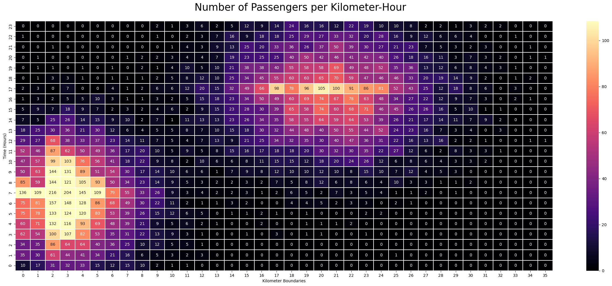

# Overview
This is a collection of projects I did to practice and demonstrate my skills. Most of the codes will not be shown here to keep this clean. Check out the individual projects for more details.
## 1_Efficient_Transportation
The schools I went to are very far from home, so I commuted regularly. While it was not common, I occasionally waited long times for jeepneys. So then I wondered, if public transportation is run by companies, how would they improve their operations to meet the demand.

Assumptions:
- The route's length is 42 kilometers
- There is a stop every kilometer
- A vehicle has a max capacity of 20
- In general, the further you travel, the more you pay
### Creating a somewhat realistic sample information
Since I do not have a datasheet provided by a company, I just created an imaginary one. It contains the following information
- Boarding time: When did the passenger board (random number generator (RNG))
- Boarding place: Where did the passenger board. Let's say the stops are labeled using numbers (RNG not exceeding the route length)
- Boarding payment: How much did the passenger pay (function of the distance traveled)

First 10 rows out of 16000 of the sample datasheet:

### Cleaning the data
Minimal cleaning is needed because the sample data is simple. I just sorted the data by time and added a new column containing the hour part of the boarding time to make visualizations cleaner.

First 10 rows of the cleaned datasheet:

### Visualizations
Visualization of the distribution of where and when passengers board:

Visualization of the distribution of profit by time and place:

Visualization of the minimum number of vehicles needed to fill the demand by hour:

*This is calculated by dividing the number of recorded passengers per hour by the max capacity of a vehicle*

### Insights
- I realized that basing how many vehicles to operate on the previous number of passengers is a mistake. This is because we are ignoring unseen information.
- The problem is that we can only gather information when passengers board. Say we field one vehicle and it is always full at every stop, containing 20 passengers. Do we conclude we only need one vehicle since in our records, the demand peaks at 20?
- Rather, it is better to look at the average percentage of seats filled of the whole fleet. 
- The sample data I am working on does not have a vehicle ID column. How can I calculate the average for the whole fleet if I do not have information about the individual vehicles?
- Using another simple random number generator for the vehicle ID might result in vehicles sometimes exceeding capacity, vehicles going backwards (when RNG generated records of vehicle 1 at stop 3 at 5:05am and then at stop 2 at 5:12am)
